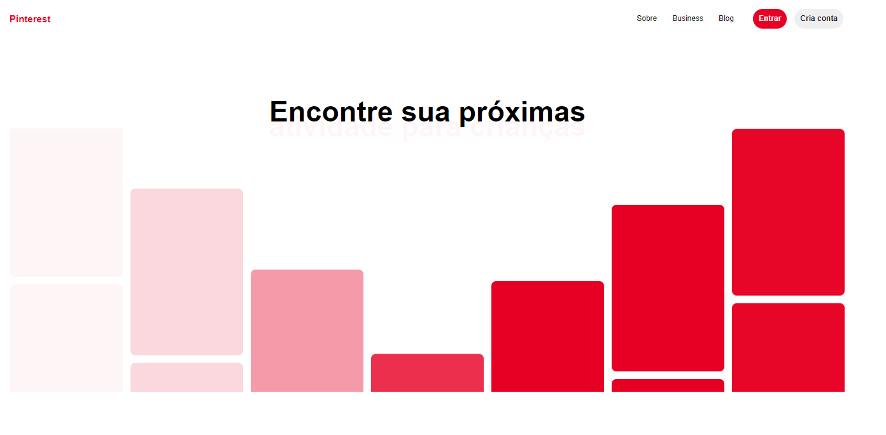

# Clone UI Vercel 💛🚀

Feito com 💙 por Hugo Alves Varella

  

## 📚 Informações sobre o projeto

- Esse projeto foi desenvolvido durante uma aula da rocketseat via youtube.

&nbsp;

## 💻 O que tem no projeto?

- Clone da pagina da Pinterest
- Uso do frame motion para Recria a animações

## 🧪 Tecnologias

Esse projeto foi desenvolvido com as seguintes tecnologias:

- [Html](https://www.w3schools.com/html/)
- [Javascript](https://developer.mozilla.org/pt-BR/docs/Web/JavaScript)
- [Sass](https://sass-lang.com/)
- [Framer Motion](https://www.framer.com/motion/)

